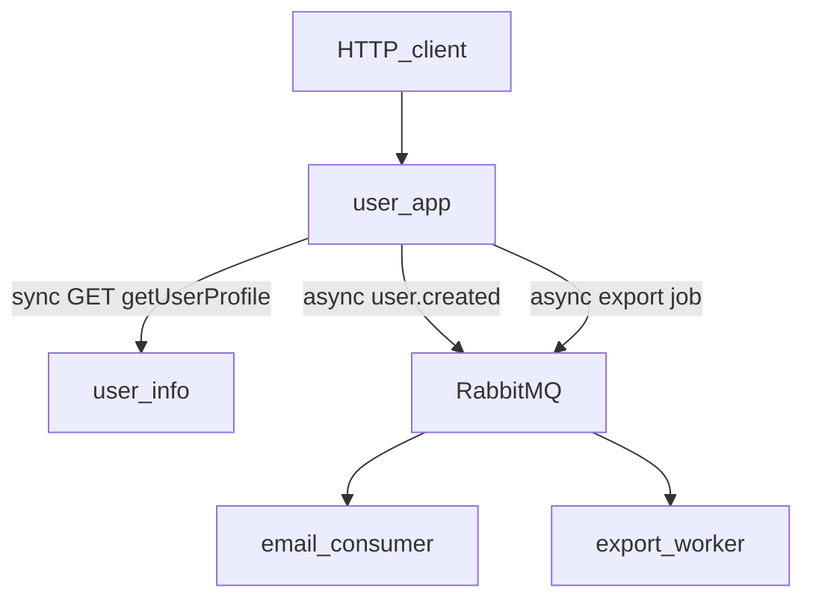
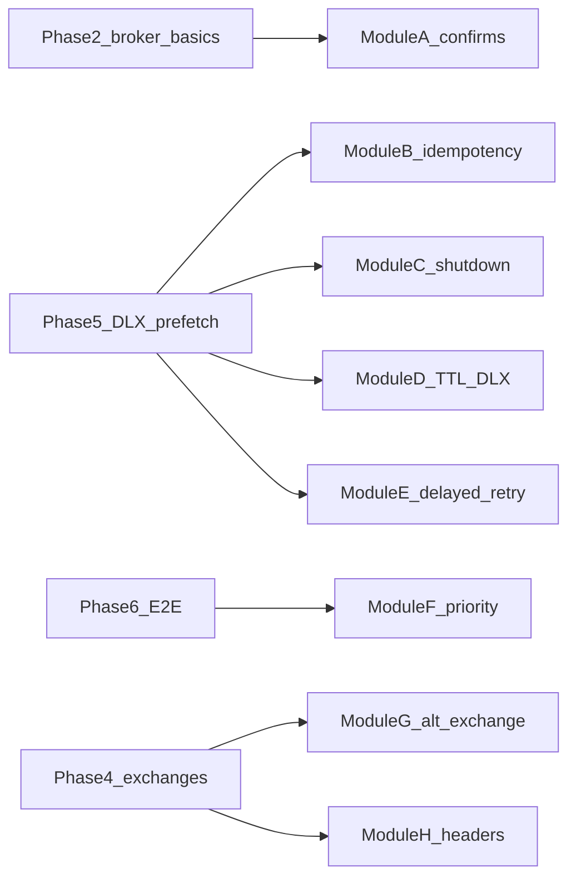

# Message queues — learning journal

Hands-on curriculum: async communication, message queues, and RabbitMQ patterns in this Node monorepo. Teaching style follows [learning-by-doing](file:///Users/htrinh@alpha-sense.com/.cursor/skills/learning-by-doing/SKILL.md): struggle first, one main concept per phase, verify before advancing.

## Goal

After these phases you can explain when **HTTP request/response** fits vs **asynchronous messaging**, operate a **RabbitMQ** topology from Node (`amqplib`), apply common **patterns** (work queue, pub/sub, routing, DLX), and wire **two concrete stories**: (1) **welcome email after signup** and (2) **profile download handled by a worker** — both grounded in this repo, with **mocked delays + logs** before the broker, then **real RabbitMQ** consumers.

## What we are building (plain English)

Two **domain-shaped** features drive the whole curriculum (not a generic “profile refresh” POST):

1. **Welcome email after user creation** — On successful `POST /users`, the HTTP response stays **fast** (`201` + user body). **Sending email** is **not** awaited in the request: Phase 1 uses a **mock** (`delay` + log: e.g. `Welcome email sent to …`). Phase 2+ publishes a `user.created` / `email.welcome` message to RabbitMQ; a **consumer** runs the same mock delay + log (stand-in for SMTP).

2. **Download user profile (worker)** — A **new** endpoint (e.g. `POST /users/:id/profile-download` or `.../export`) requests a **long-running** job. The API returns **`202 Accepted`** with a `jobId` (or similar) **immediately** — it does **not** wait for user-info or file generation. A **worker** consumes jobs, uses **mock delay** to simulate heavy work (PDF/build, large fetch), then logs completion (e.g. `Profile export completed for job …`). Phase 1 stub: in-process queue or timer; Phase 2+ RabbitMQ work queue + consumer(s).

**Infra** — RabbitMQ in Docker, `amqplib`, optional `user-info` only if you want a real HTTP fetch inside the worker later; **not required** for the mocked worker path.

**Learning slices** — Still include small isolated demos (hello queue, exchanges, DLX) **using the same two stories** where possible so you do not context-switch.

If something in a phase says “stub,” that only means Phase 1 fakes the broker (delay + log + maybe in-memory `jobId`). From Phase 2 onward the deliverable is **real RabbitMQ**, not a simulation.

## Concrete deliverables by phase

| Phase | You will have (tangible) |
|-------|----------------------------|
| **1** | **`POST /users`**: after create, **welcome email** runs async (mock: `delay` + log; **do not** block `201`). **`POST /users/:id/profile-download`** (name flexible): **202** + `jobId`; worker path **mocked** (delay + log “export done”). **No** RabbitMQ yet. |
| **2** | Broker running; **one queue**, publish/consume/ack; wire **either** welcome-email **or** export job (pick one first). |
| **3** | **Work queue** with **two consumers** on export jobs (or email queue) — observe load sharing. |
| **4** | **Three demos** (direct / fanout / topic) — can be separate scripts or tagged routing for `email.*` vs `export.*` events. |
| **5** | **Prefetch**, **nack/requeue**, **DLX** — e.g. poison export job lands on DLQ. |
| **6** | **Both** stories on real RabbitMQ: create user → **queue** → welcome-email consumer; request download → **queue** → export worker (delay + log). Optional: `correlationId` / `x-request-id` in message headers. |

Exact file names can be chosen during implementation; the journal stays valid as long as these artifacts exist.

## Project context

| Item | Detail |
|------|--------|
| Stack | TypeScript, Express, workspaces: `user`, `user-info`, `packages/observability` |
| Sync anchor | [`user/src/shared/userInfoClient.ts`](user/src/shared/userInfoClient.ts) — HTTP `fetch` to user-info; caller waits |
| Compose | [`docker-compose.yml`](docker-compose.yml) — add `rabbitmq` (management UI), env e.g. `RABBITMQ_URL` |
| Broker | RabbitMQ (AMQP), Node client: [`amqplib`](https://github.com/amqp-node/amqplib) |

## Architecture (target)



**Sync path (unchanged):** `GET /users/:id` still merges user + profile via HTTP to user-info when the client needs data immediately.

**Async paths:** signup triggers **welcome email**; **profile download** request triggers **export worker** — both decoupled from the HTTP handler once on RabbitMQ.

## What already exists vs what we add

| Already in repo | What we add |
|-----------------|-------------|
| HTTP client + traces for profile fetch | RabbitMQ, `amqplib`, messaging helpers |
| `POST /users` returns created user | After create: **welcome email** handoff (mock → queue) |
| `GET` with profile | **New** `POST …/profile-download` → **202** + `jobId`; **worker** (mock delay) |
| Observability | Optional: `correlationId` on messages; logs for email + export lines |

## Build plan (phases)

Mark each phase **Done** in the Session notes when verify passes.

### Phase 1 — Async communication vs sync HTTP

**Goal:** Same HTTP request **does not** wait for “email” or “export” work; contrast with `GET` + `getUserProfile` which **does** wait.

**Why build instead of reuse:** The repo already has sync read; it does **not** have signup side-effects or a job-style download.

**What we build:**

**A — Welcome email (async, mocked)**  
- Extend **`POST /users`** (create user): after persisting the user, start **welcome email** in the background **without** `await`ing it in the HTTP handler.  
- Mock: `setTimeout` / shared `delay(ms)` then **log** e.g. `[welcome-email] sent to user {id} ({email})`.  
- **HTTP response:** still **`201`** + `{ data: user }` — client does **not** wait for the delay.

**B — Profile download / export (worker, mocked heavy work)**  
- New endpoint e.g. **`POST /users/:id/profile-download`** (name up to you).  
- **HTTP response:** **`202`** + body like `{ "data": { "jobId": "…", "status": "queued" } }`.  
- **Stub worker:** either `void` async IIFE or in-memory job map: after **mock delay** (longer than email, e.g. 2–3s), **log** e.g. `[export] job {jobId} completed for user {id}`.  
- **No** user-info fetch in Phase 1 unless you want extra realism; focus is **job acceptance + slow worker**.

**Proposed API shape:**

| Flow | Method / path | Waits for “slow” work? | Status | Notes |
|------|----------------|----------------------|--------|--------|
| **Read profile (existing)** | `GET /users/:id` | Yes — `getUserProfile` | `200` | Returns user + profile in one response. |
| **Create user + email** | `POST /users` | **No** for email mock | `201` | Email mock runs after response is sent (or in parallel without blocking `await`). |
| **Request export** | `POST /users/:id/profile-download` | **No** | **`202`** | Returns `jobId` immediately; worker completes later. |

**Phase 2+:** replace stubs with RabbitMQ — publish `user.created` → email consumer; publish `export.requested` → export consumer(s).

**Key commands / queries:**

```bash
# Create user — watch server logs for welcome-email line after ~delay
curl -s -X POST http://localhost:3000/users -H "Content-Type: application/json" \
  -d '{"email":"a@b.com","name":"Ada"}' -w "\nHTTP %{http_code}\n"

# Request export — 202 + jobId; logs show export completion after delay
curl -s -X POST http://localhost:3000/users/<USER_ID>/profile-download -w "\nHTTP %{http_code}\n"
```

**Verify:**

- [ ] `POST /users` returns **201** quickly; welcome-email log appears **after** mock delay (not blocking response).
- [ ] `POST …/profile-download` returns **202** with `jobId`; export log appears **after** mock delay.
- [ ] `GET /users/:id` still merges profile synchronously when you need the full picture.

**Learn:** The browser/client gets **final data** only on sync paths; **async** paths return **acceptance** or **fire-and-forget** side effects.

---

### Phase 2 — Broker basics (connection, channel, publish, consume, ack)

**Goal:** One message travels through RabbitMQ with explicit consumer ack.

**Why build instead of reuse:** No AMQP client in the project yet.

**What we build:**

- `amqplib` dependency; connect, assert queue, publish JSON, consume, `ack` (or `nack` in a later phase).
- Use a **confirm channel** for the publisher path: register `waitForConfirms` / confirm listeners so the first real publish from the API logs broker **ack** or **nack** (see [Publisher Confirms](https://www.rabbitmq.com/docs/confirms)).
- Wire **one** story first: e.g. `user.created` → consumer runs the same **welcome-email** mock (delay + log).

**Key commands / queries:**

```bash
cd /path/to/node-playground
docker compose ps
# Management UI: http://localhost:15672 (guest/guest) when service is added
```

**Verify:**

- [ ] Message published appears in consumer stdout/log.
- [ ] Broker healthy in Compose; management UI loads.
- [ ] **Publisher confirms:** publishing uses a confirm channel; logs (or tests) show broker **ack** after a successful publish, and you can explain the difference vs “TCP sent” without confirm.

**Learn:** At-least-once delivery means your handler may run more than once unless you design for idempotency. **Consumer ack** covers “did I finish processing?”; **publisher confirms** cover “did the broker accept the message?” — both matter in production.

---

### Phase 3 — Work queue (competing consumers)

**Goal:** Multiple consumers share load; round-robin dispatch.

**What we build:**

- **Export jobs** (or email) on one queue, **two consumer processes**, observe distribution under load.

**Verify:**

- [ ] With two consumers running, work splits across both (see logs or queue depth).

**Learn:** Horizontal scale of *processing* without changing the producer.

---

### Phase 4 — Exchanges and bindings (direct, fanout, topic)

**Goal:** Route messages by exchange type and routing key / patterns.

**What we build:**

- Minimal examples: **direct** (routing key), **fanout** (broadcast), **topic** (wildcard keys).

**Verify:**

- [ ] Each topology demonstrable with a scripted publish + consumer(s); RabbitMQ UI shows bindings.

**Learn:** Exchanges decouple publishers from queue names; bindings connect exchanges to queues.

---

### Phase 5 — Reliability (prefetch, nack/requeue, DLX)

**Goal:** Handle slow consumers and poison messages safely.

**What we build:**

- `prefetch`, negative ack with requeue, **dead-letter exchange** for failures.

**Verify:**

- [ ] Bad message lands on DLQ (or DLX-bound queue), not lost silently.

**Learn:** Retries and DLX turn “fail forever” into observable, recoverable states.

---

### Phase 6 — End-to-end in this monorepo

**Goal:** **Both** stories run on RabbitMQ: signup → welcome-email consumer; profile-download → export worker(s).

**What we build:**

- `POST /users` publishes **user.created** (or `email.welcome`); consumer: delay + log.  
- `POST …/profile-download` publishes **export.requested**; worker(s): delay + log.  
- Optional: second consumer in `user-info` only if you want HTTP fetch there — not required for mocks.

**Verify:**

- [ ] Create user → message visible in broker / consumed → welcome log.  
- [ ] Download request → job message → export log.  
- [ ] Optional: `correlationId` in headers.

**Learn:** Production combines **sync reads** with **async side effects** and **job queues** for heavy work.

---

### Optional modules (A–I) — after core phases

Pick **2–4** modules after Phase **5** or **6** (not all at once). Highest **learning-per-hour** defaults: **A** (publisher confirms), **B** (idempotent consumer), **C** (graceful shutdown). **D** and **E** deepen reliability; **G** and **H** extend Phase 4 topology literacy; **F** and **I** are specialized.

| Module | Hands-on task | What you learn |
|--------|----------------|----------------|
| **A. Publisher confirms** | After `POST /users` or export publish, use a **confirm channel**; log broker **ack**/**nack**. Optionally slow the consumer / fill the queue and observe publish behavior. | Publisher-side reliability; fire-and-forget TCP write vs broker acceptance. |
| **B. Idempotency / duplicate delivery** | Publish the same `jobId` twice or restart consumer mid-ack; make the export consumer **safe** (e.g. in-memory `Set` or “processed jobIds” log). | At-least-once delivery; DLX does not replace idempotency. |
| **C. Graceful shutdown** | `SIGTERM`: stop consuming (`channel.cancel` or close channel), **drain in-flight** acks, then exit. Test with `docker stop` or `kill`. | Worker draining; pairs with prefetch. |
| **D. Message TTL + DLX** | **Per-queue or per-message TTL** on export jobs; let one message expire into the same DLX pattern as Phase 5. | Time-based dead-letter vs poison-message dead-letter. |
| **E. Delayed retry (plugin)** | Enable `rabbitmq_delayed_message_exchange` in Compose; failed export → delay exchange → requeue with backoff (cap retries). | Retries without hammering the handler; plugin ops cost. |
| **F. Priority queue** | Export queue with `x-max-priority`; low vs high priority jobs with **prefetch(1)** on one consumer. | Priority semantics; ordering limits across consumers. |
| **G. Alternate exchange** | Mis-route (wrong routing key to a direct exchange); **alternate exchange** catches unroutable publishes. | Publishing mistakes visible, not silently dropped. |
| **H. Headers exchange** | Fourth routing demo: `email.welcome` vs `export.requested` via **headers** match (not only topic keys). | Attribute-based vs hierarchical routing. |
| **I. Quorum queue (stretch)** | Declare export queue as **quorum** type; note UI / behavior (single node is enough to assert type). | Durability/replication vs classic; interview-relevant. |

**Suggested placement**



- **With Phase 2–3:** A; optionally C once a long-running consumer exists.
- **With Phase 5–6:** B, D, E, F.
- **Phase 4 extensions:** G, H.

**Defer unless you want extra scope:** RabbitMQ **Streams** (different consumption model), **shovel/federation** (ops-heavy on one machine), **full outbox + DB transactions** (production pattern; heavy for a first MQ pass).

Mark chosen modules in **Session notes** below.

---

### Optional stretch — Request/reply over AMQP

**Goal:** See why HTTP is usually simpler for synchronous RPC.

**What we build:**

- Correlation id + reply queue (only if time).

**Verify:**

- [ ] Round-trip works; you can articulate tradeoffs vs REST.

---

## Further reading

Official **RabbitMQ** / AMQP (maps to phases):

- [RabbitMQ tutorials (Hello World → Work queues → Pub/Sub → Routing → Topics)](https://www.rabbitmq.com/tutorials.html) — use the **JavaScript** tab for code close to Node/`amqplib`.
- [AMQP 0-9-1 model explained](https://www.rabbitmq.com/tutorials/amqp-concepts.html) — connections, channels, exchanges, queues, bindings.
- [Exchanges](https://www.rabbitmq.com/docs/exchanges) — direct, fanout, topic, headers.
- [Queues](https://www.rabbitmq.com/docs/queues) — durability, optional arguments (incl. DLX-related).
- [Consumer Acknowledgements and Publisher Confirms](https://www.rabbitmq.com/docs/confirms) — at-least-once, ack/nack, publisher confirms.
- [Dead Letter Exchanges](https://www.rabbitmq.com/docs/dlx) — poison messages, retries, DLX routing.
- [Quorum queues](https://www.rabbitmq.com/docs/quorum-queues) — optional after classic tutorials.

**Node client:**

- [amqplib (GitHub)](https://github.com/amqp-node/amqplib)

**Production-oriented blogs (RabbitMQ):**

- [RabbitMQ Best Practices — Part 1](https://www.cloudamqp.com/blog/part1-rabbitmq-best-practice.html)
- [RabbitMQ Best Practices — Part 2 (high performance)](https://www.cloudamqp.com/blog/part2-rabbitmq-best-practice-for-high-performance.html)
- [RabbitMQ Best Practices — Part 3 (HA)](https://www.cloudamqp.com/blog/part3-rabbitmq-best-practice-for-high-availability.html)
- [13 Common RabbitMQ Mistakes](https://www.cloudamqp.com/blog/part4-rabbitmq-13-common-errors.html)
- [RabbitMQ checklist for production](https://www.cloudamqp.com/blog/rabbitmq-checklist-for-production-environments-a-complete-guide.html)

**Async / messaging concepts (broker-agnostic):**

- [Martin Fowler — What do you mean by “Event-Driven”?](https://martinfowler.com/articles/201701-event-driven.html)
- Microsoft Learn — [Queue-Based Load Leveling pattern](https://learn.microsoft.com/en-us/azure/architecture/patterns/queue-based-load-leveling)
- AWS — [What Is a Message Queue?](https://aws.amazon.com/what-is/message-queue/)

**Optional deep dive:** _Enterprise Integration Patterns_ (Hohpe & Woolf) — [EIP pattern index](https://www.enterpriseintegrationpatterns.com/).

## Session notes

| Phase | Status | Gotchas / surprises |
|-------|--------|---------------------|
| 1 | not started | |
| 2 | not started | |
| 3 | not started | |
| 4 | not started | |
| 5 | not started | |
| 6 | not started | |

**Optional modules (A–I)** — mark when done: A __ · B __ · C __ · D __ · E __ · F __ · G __ · H __ · I __

## Resume prompt

Copy into a new chat when continuing:

```text
I am learning message queues by building in the node-playground monorepo (user + user-info services).
The full plan is in MessageQueueLearning.md at the repo root.
Features: (1) welcome email after POST /users — async, mocked delay+log; (2) POST …/profile-download — 202 + jobId, export worker with mocked delay.
Current state: [what is done / what is next].
Please read the journal first, then continue from Phase [N].
Optional modules A–I: [which are done or which you want next — see journal].
Broker: RabbitMQ in Docker; Node uses amqplib.
```
