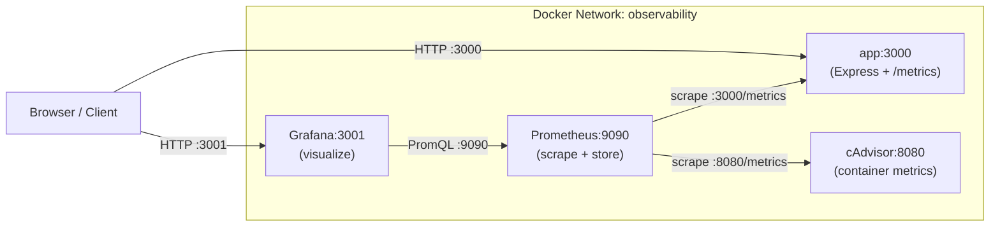

# Production Observability Stack: Prometheus + Grafana

> **Stack:** Node.js · Express · pino · Docker Compose · prom-client · Prometheus · Grafana · cAdvisor

---

## Table of Contents

1. [Architecture Overview](#1-architecture-overview)
2. [Metrics Design](#2-metrics-design)
3. [Prometheus Concepts — Teaching Section](#3-prometheus-concepts--teaching-section)
4. [Implementation](#4-implementation)
5. [Grafana Dashboard](#5-grafana-dashboard)
6. [Alerting](#6-alerting)
7. [Operational Best Practices](#7-operational-best-practices)
8. [Common Mistakes](#8-common-mistakes)

---

## 1. Architecture Overview

### How Prometheus Works: Pull Model

Prometheus **pulls** metrics from your app. Your app does not push data to Prometheus.

**Why pull?**
- Prometheus controls the scrape schedule — it can detect if a target is down (no push = silent failure vs. `up == 0`)
- Easier to reason about backpressure: if Prometheus is slow, it skips a scrape; your app never blocks
- Service discovery is simpler: Prometheus discovers targets, not the other way around
- Push-based systems (StatsD, DataDog agent) invert this — fine for short-lived jobs, but awkward for long-running services

**Why `/metrics`?**
By convention, Prometheus expects a plaintext HTTP endpoint at `/metrics` returning the [OpenMetrics](https://openmetrics.io/) exposition format. Each scrape is a point-in-time snapshot of all metric values.

```
GET /metrics HTTP/1.1
→ 200 OK
Content-Type: text/plain; version=0.0.4

# HELP http_requests_total Total HTTP requests
# TYPE http_requests_total counter
http_requests_total{method="GET",route="/users",status="200"} 1423
```

### Scrape Interval

Default: **15 seconds**. This means:
- `rate()` functions need at least a 4× window (`[1m]` minimum for 15s scrape)
- Lower interval = higher Prometheus storage and CPU load
- For most REST APIs, 15s gives enough resolution for dashboards and alerts

### Network Topology



### docker-compose.yml

```yaml
version: "3.9"

services:
  app:
    build: .
    ports:
      - "3000:3000"
    env_file:
      - .env
    volumes:
      - ./logs:/app/logs
    restart: unless-stopped
    networks:
      - observability

  prometheus:
    image: prom/prometheus:v2.52.0
    ports:
      - "9090:9090"
    volumes:
      - ./prometheus/prometheus.yml:/etc/prometheus/prometheus.yml:ro
      - ./prometheus/rules:/etc/prometheus/rules:ro
      - prometheus_data:/prometheus
    command:
      - "--config.file=/etc/prometheus/prometheus.yml"
      - "--storage.tsdb.path=/prometheus"
      - "--storage.tsdb.retention.time=15d"
      - "--web.enable-lifecycle"          # allows POST /-/reload
    restart: unless-stopped
    networks:
      - observability

  grafana:
    image: grafana/grafana:10.4.2
    ports:
      - "3001:3000"
    environment:
      - GF_SECURITY_ADMIN_USER=admin
      - GF_SECURITY_ADMIN_PASSWORD=admin
      - GF_USERS_ALLOW_SIGN_UP=false
    volumes:
      - grafana_data:/var/lib/grafana
    restart: unless-stopped
    networks:
      - observability
    depends_on:
      - prometheus

  cadvisor:
    image: gcr.io/cadvisor/cadvisor:v0.49.1
    ports:
      - "8080:8080"
    volumes:
      - /:/rootfs:ro
      - /var/run:/var/run:ro
      - /sys:/sys:ro
      - /var/lib/docker/:/var/lib/docker:ro
    restart: unless-stopped
    networks:
      - observability

volumes:
  prometheus_data:
  grafana_data:

networks:
  observability:
    driver: bridge
```

**Why cAdvisor?** Your Node.js process runs inside a Docker container. cAdvisor reads cgroup stats directly from the host kernel and exposes them as Prometheus metrics — container CPU throttling, memory usage vs limit, network I/O. You cannot get these from inside the container itself without root access.

**Why not Node Exporter here?** Node Exporter exposes host-level OS metrics (disk, network interfaces, kernel). For a typical containerized microservice, cAdvisor + `prom-client` default metrics covers everything you need. Add Node Exporter only if you own the underlying VM/host and need host-level visibility.

---

## 2. Metrics Design

### Metric Selection Rationale

Every metric must answer an operational question. If you cannot answer "what alert would I write for this?", do not instrument it.

| Metric | Type | Operational Question |
|---|---|---|
| `http_request_duration_seconds` | Histogram | Is latency degrading? What's the p95? |
| `http_requests_total` | Counter | What is the request rate? Which routes are hit most? |
| `http_requests_in_flight` | Gauge | Is the app currently overloaded? |
| `process_cpu_seconds_total` | Counter (default) | Is the app CPU-bound? |
| `process_resident_memory_bytes` | Gauge (default) | Is memory growing (leak)? |
| `nodejs_eventloop_lag_seconds` | Gauge (default) | Is the event loop blocked? |
| `process_start_time_seconds` | Gauge (default) | How long has the process been up? |
| `container_cpu_usage_seconds_total` | Counter (cAdvisor) | CPU usage at container level |
| `container_memory_usage_bytes` | Gauge (cAdvisor) | Memory at container level vs limit |

### HTTP Duration Histogram — Bucket Design

Histogram buckets define the resolution of your latency distribution. Wrong buckets = useless percentiles.

```
Default prom-client buckets: [0.005, 0.01, 0.025, 0.05, 0.1, 0.25, 0.5, 1, 2.5, 5, 10]
```

For a REST API, these are reasonable. Adjust if your API has different characteristics:
- Pure DB-backed API: keep defaults
- File upload endpoints: add `[10, 30, 60]`
- Sub-millisecond cache endpoints: add `[0.001, 0.002, 0.003]`

The tradeoff: more buckets = more memory per time series = more Prometheus storage.

### Label Cardinality — The Most Important Rule

Labels create time series. Every unique combination of label values = one time series stored forever.

**Safe labels** (bounded cardinality):
- `method`: GET, POST, PATCH, DELETE — 4 values
- `route`: `/users`, `/users/:id`, `/health` — bounded by your route table
- `status`: HTTP status code — ~10 realistic values

**Never use as labels:**
- `userId` — millions of time series, Prometheus crashes
- `requestId` / `traceId` — unique per request
- `email`, `ip`, `sessionId` — unbounded

**Rule of thumb:** if the number of unique values could exceed 1,000, it is not a label.

### Why `route` and Not `path`

`req.path` on `/users/123` gives `/users/123` — unique per user, infinite cardinality.
`route` should be the Express route pattern: `/users/:id`.

You must extract this from `req.route.path` after the route handler runs (in a response hook), not from `req.path`.

---

## 3. Prometheus Concepts — Teaching Section

### 3.1 Counter

**What it is:** A monotonically increasing number. It only ever goes up. On process restart, it resets to 0.

**What problem it solves:** Counting events over time — requests, errors, bytes sent. You cannot directly query a counter for a rate; you use `rate()` to compute the per-second increase.

**When NOT to use it:**
- Do not use a Counter for anything that can decrease (e.g., current connections, queue depth). That is a Gauge.
- Do not read the raw counter value in dashboards — it is meaningless without a rate function.

**Real PromQL example:**
```promql
# Requests per second over last 5 minutes
rate(http_requests_total[5m])

# Error rate (5xx) per second
rate(http_requests_total{status=~"5.."}[5m])
```

---

### 3.2 Gauge

**What it is:** A value that can go up and down arbitrarily. A snapshot of the current state.

**What problem it solves:** Measuring current state — memory usage, number of in-flight requests, queue length, temperature.

**When NOT to use it:**
- Do not use a Gauge for event counts. If Prometheus scrapes 1 second late, you lose that data. Counters are cumulative; Gauges are not.
- Do not use `rate()` on a Gauge — it is meaningless.

**Real PromQL example:**
```promql
# Current in-flight requests
http_requests_in_flight

# Process memory in MB
process_resident_memory_bytes / 1024 / 1024

# Container memory usage as % of limit
container_memory_usage_bytes{name="node-playground-app-1"} 
  / container_spec_memory_limit_bytes{name="node-playground-app-1"} * 100
```

---

### 3.3 Histogram

**What it is:** A Histogram samples observations (like request durations) and counts them into configurable buckets. It automatically creates three time series:

- `metric_name_bucket{le="0.1"}` — count of observations ≤ 100ms
- `metric_name_sum` — sum of all observed values
- `metric_name_count` — total number of observations

**What problem it solves:** You need percentile latency (p95, p99) but Prometheus does not store raw data points. Histograms give you an approximation using pre-aggregated buckets.

**`_bucket` explained:**
Each `le` (less than or equal) label is a cumulative counter. If `le="0.5"` has value 900 and `le="1.0"` has value 950, then 50 requests took between 500ms and 1s.

**`_sum` and `_count`:**
- Average latency = `rate(metric_sum[5m]) / rate(metric_count[5m])`
- Count alone = request rate

**When NOT to use it:**
- Do not use Histogram for values that are not bounded and meaningfully distributed (e.g., user IDs). Use it for durations, sizes, latencies.
- Do not define too many buckets (>15) — each bucket is a separate time series per label combination.

**Real PromQL example:**
```promql
# p95 latency across all routes
histogram_quantile(0.95,
  sum by (le) (rate(http_request_duration_seconds_bucket[5m]))
)

# p95 latency per route
histogram_quantile(0.95,
  sum by (le, route) (rate(http_request_duration_seconds_bucket[5m]))
)

# Average latency
rate(http_request_duration_seconds_sum[5m])
  / rate(http_request_duration_seconds_count[5m])
```

---

### 3.4 `rate()` vs `irate()`

**`rate(metric[window])`**
- Calculates per-second average rate over the entire window
- Smooths out spikes
- Use for dashboards, slow-moving alerts, SLO calculations
- Minimum window: 4× scrape interval (15s scrape → 1m minimum window)

**`irate(metric[window])`**
- Uses only the last two data points in the window
- Highly sensitive to recent spikes
- Use for debugging a live incident, not for alerting
- Produces noisy graphs in dashboards

**Rule of thumb:** use `rate()` for everything unless you are debugging a spike in real time.

```promql
# Stable request rate — good for dashboards
rate(http_requests_total[5m])

# Instant rate — good for debugging NOW
irate(http_requests_total[5m])
```

---

### 3.5 `histogram_quantile()`

**What it is:** A function that estimates a percentile from Histogram bucket data.

**Syntax:**
```promql
histogram_quantile(φ, sum by (le) (rate(metric_bucket[window])))
```
- `φ` is the quantile: 0.5 = median, 0.95 = p95, 0.99 = p99
- `sum by (le)` is required — it aggregates across all instances
- `rate(...)` converts cumulative counters to per-second rates first

**Why `sum by (le)` is required:**
If you have multiple app replicas, each emits its own bucket series. You must sum across replicas before computing the quantile, otherwise you get a quantile per replica.

**Accuracy:**
The result is approximate. Accuracy depends on bucket resolution around the target percentile. If p95 falls between the 0.5 and 1.0 second buckets, the estimate is interpolated linearly.

**When NOT to use it:**
- Do not compute quantiles without `rate()` — raw cumulative buckets give wrong results
- Do not use for exact values where accuracy matters (use a Summary if you need per-instance exact quantiles, though Summaries cannot be aggregated across instances)

---

### 3.6 Recording Rules

**What they are:** Pre-computed PromQL expressions stored as new time series. Prometheus evaluates them on a schedule and stores the result.

**What problem they solve:**
- Expensive queries (histogram_quantile over many series) run on every Grafana panel refresh — slow dashboards
- Recording rules compute once per evaluation interval, dashboards query the cheap pre-computed result
- Enable alerting on complex expressions without re-computing them in the alert rule

**When NOT to use them:**
- Do not create a recording rule for every metric — only for queries that are slow or used in multiple places
- Do not use for exploration/ad-hoc queries

**Naming convention:** `level:metric:operation`
```yaml
# prometheus/rules/recording.yml
groups:
  - name: http_recording
    interval: 1m
    rules:
      - record: job:http_requests_total:rate5m
        expr: sum by (job, method, route, status) (rate(http_requests_total[5m]))

      - record: job:http_request_duration_seconds:p95_5m
        expr: |
          histogram_quantile(0.95,
            sum by (le, job, route) (rate(http_request_duration_seconds_bucket[5m]))
          )

      - record: job:http_error_rate:ratio5m
        expr: |
          sum by (job) (rate(http_requests_total{status=~"5.."}[5m]))
          /
          sum by (job) (rate(http_requests_total[5m]))
```

---

### 3.7 Alerting Rules

Alerts fire when a PromQL expression evaluates to a non-zero result for a sustained `for` duration.

**Anatomy of an alert:**
```yaml
- alert: AlertName
  expr: <PromQL that is non-zero when the problem exists>
  for: 5m          # must be true for this long to avoid flapping
  labels:
    severity: critical
  annotations:
    summary: "Human-readable summary"
    description: "Detailed description with {{ $value }}"
```

**`for` duration matters:**
- Too short: alerts flap on transient spikes
- Too long: you get paged late
- 5m is a good starting point for most production alerts

---

## 4. Implementation

### 4.1 Install prom-client

```bash
npm install prom-client
```

### 4.2 Metrics Module — `src/shared/metrics.ts`

```typescript
import { Registry, collectDefaultMetrics, Counter, Gauge, Histogram } from 'prom-client';

// Isolated registry — avoids polluting the global default registry,
// which matters in test environments where modules are re-imported.
export const registry = new Registry();

// Default metrics: process CPU, memory, event loop lag, file descriptors, uptime.
// These are the first things you check when debugging a Node.js performance issue.
collectDefaultMetrics({ register: registry });

export const httpRequestsTotal = new Counter({
  name: 'http_requests_total',
  help: 'Total number of HTTP requests',
  labelNames: ['method', 'route', 'status'],
  registers: [registry],
});

export const httpRequestDuration = new Histogram({
  name: 'http_request_duration_seconds',
  help: 'HTTP request duration in seconds',
  labelNames: ['method', 'route', 'status'],
  // Buckets tuned for a typical REST API.
  // Adjust upper bounds if your p99 regularly exceeds 2.5s.
  buckets: [0.005, 0.01, 0.025, 0.05, 0.1, 0.25, 0.5, 1, 2.5, 5],
  registers: [registry],
});

export const httpRequestsInFlight = new Gauge({
  name: 'http_requests_in_flight',
  help: 'Number of HTTP requests currently being processed',
  labelNames: ['method'],
  registers: [registry],
});
```

### 4.3 Prometheus Middleware — `src/shared/middleware/metrics.ts`

```typescript
import { Request, Response, NextFunction } from 'express';
import {
  httpRequestsTotal,
  httpRequestDuration,
  httpRequestsInFlight,
} from '../metrics.js';

export function metricsMiddleware(req: Request, res: Response, next: NextFunction): void {
  const method = req.method;

  // Increment in-flight BEFORE the handler runs
  httpRequestsInFlight.inc({ method });

  const end = httpRequestDuration.startTimer();

  res.on('finish', () => {
    // req.route is only populated after the matched route handler runs.
    // Fall back to req.path only if no route matched (404 handler).
    // NEVER use req.path directly for matched routes — it contains dynamic segments.
    const route = req.route?.path ?? 'unmatched';
    const status = String(res.statusCode);

    httpRequestsTotal.inc({ method, route, status });
    end({ method, route, status });
    httpRequestsInFlight.dec({ method });
  });

  next();
}
```

### 4.4 Metrics Endpoint — add to `src/app.ts`

```typescript
import { registry } from './shared/metrics.js';
import { metricsMiddleware } from './shared/middleware/metrics.js';

// Inside createApp(), before feature routes:

// Instrument all requests
app.use(metricsMiddleware);

// Expose metrics for Prometheus scrape.
// Do NOT put this behind auth in a private network — Prometheus needs unauthenticated access.
// DO put it behind a network firewall so it is not publicly reachable.
app.get('/metrics', async (_req, res) => {
  res.set('Content-Type', registry.contentType);
  res.end(await registry.metrics());
});
```

### 4.5 Prometheus Config — `prometheus/prometheus.yml`

```yaml
global:
  scrape_interval: 15s      # How often to scrape. Lower = more storage + CPU.
  evaluation_interval: 15s  # How often to evaluate rules.

rule_files:
  - /etc/prometheus/rules/*.yml

scrape_configs:
  - job_name: "node-playground"
    static_configs:
      - targets: ["app:3000"]
    # Relabeling: keep only essential labels to control cardinality.
    # By default, Prometheus adds instance and job labels automatically.

  - job_name: "cadvisor"
    static_configs:
      - targets: ["cadvisor:8080"]
    # cAdvisor exposes hundreds of metrics. Drop what you don't need
    # to reduce storage. Example:
    metric_relabel_configs:
      - source_labels: [__name__]
        regex: "container_(cpu_usage_seconds_total|memory_usage_bytes|memory_working_set_bytes|spec_memory_limit_bytes|network_receive_bytes_total|network_transmit_bytes_total)"
        action: keep
```

**Why metric relabeling on cAdvisor?** cAdvisor emits ~200 metrics per container. Most are irrelevant for a Node.js service. Dropping them at ingest reduces Prometheus storage by 60–80%.

### 4.6 Alert Rules — `prometheus/rules/alerts.yml`

```yaml
groups:
  - name: node_playground_alerts
    rules:

      # App is unreachable — highest priority
      - alert: AppDown
        expr: up{job="node-playground"} == 0
        for: 1m
        labels:
          severity: critical
        annotations:
          summary: "App is down"
          description: "Prometheus cannot scrape {{ $labels.instance }}. The process may have crashed."

      # More than 5% of requests are 5xx over a 5-minute window
      - alert: HighErrorRate
        expr: |
          (
            sum(rate(http_requests_total{status=~"5.."}[5m]))
            /
            sum(rate(http_requests_total[5m]))
          ) > 0.05
        for: 5m
        labels:
          severity: critical
        annotations:
          summary: "High HTTP error rate"
          description: "Error rate is {{ $value | humanizePercentage }} over the last 5 minutes."

      # p95 latency exceeds 500ms sustained for 10 minutes
      - alert: HighP95Latency
        expr: |
          histogram_quantile(0.95,
            sum by (le) (rate(http_request_duration_seconds_bucket[5m]))
          ) > 0.5
        for: 10m
        labels:
          severity: warning
        annotations:
          summary: "High p95 latency"
          description: "p95 latency is {{ $value | humanizeDuration }}. Investigate slow routes."

      # Container is using more than 90% of its memory limit
      - alert: ContainerMemoryNearLimit
        expr: |
          container_memory_usage_bytes{name=~"node-playground.*"}
          /
          container_spec_memory_limit_bytes{name=~"node-playground.*"}
          > 0.9
        for: 5m
        labels:
          severity: warning
        annotations:
          summary: "Container memory near limit"
          description: "Container {{ $labels.name }} is at {{ $value | humanizePercentage }} of memory limit. OOM kill imminent."
```

---

## 5. Grafana Dashboard

### Dashboard Layout

```
Row 1: Golden Signals (4 panels)
┌──────────────────┬──────────────────┬──────────────────┬──────────────────┐
│  Request Rate    │  Error Rate      │  p95 Latency     │  In-Flight Reqs  │
│  (stat + graph)  │  (stat + graph)  │  (stat + graph)  │  (gauge)         │
└──────────────────┴──────────────────┴──────────────────┴──────────────────┘

Row 2: Latency Distribution (2 panels)
┌────────────────────────────────────┬───────────────────────────────────────┐
│  Latency Heatmap (histogram_bucket)│  p50 / p95 / p99 per route            │
└────────────────────────────────────┴───────────────────────────────────────┘

Row 3: Resource Usage (3 panels)
┌──────────────────┬──────────────────┬──────────────────────────────────────┐
│  Process CPU     │  Process Memory  │  Event Loop Lag                      │
└──────────────────┴──────────────────┴──────────────────────────────────────┘

Row 4: Container Metrics (2 panels — cAdvisor)
┌────────────────────────────────────┬───────────────────────────────────────┐
│  Container CPU Throttling          │  Container Memory vs Limit            │
└────────────────────────────────────┴───────────────────────────────────────┘
```

### Panel 1 — Request Rate

**What it tells you:** How many requests per second your API is handling right now. Sudden drops indicate the app crashed or a load balancer removed it.

```promql
sum(rate(http_requests_total[5m])) by (route)
```
Visualization: Time series. Stack by route to see which endpoint drives load.

---

### Panel 2 — Error Rate

**What it tells you:** Percentage of requests returning 5xx. The primary SLO signal. Use this for on-call alerts.

```promql
sum(rate(http_requests_total{status=~"5.."}[5m]))
/
sum(rate(http_requests_total[5m]))
```
Visualization: Time series, percentage unit. Add threshold line at 1% (warning) and 5% (critical).

---

### Panel 3 — p95 Latency

**What it tells you:** 95% of requests complete within this duration. More useful than average — average hides tail latency. If p95 rises while p50 is stable, a subset of requests (likely DB-heavy) is degrading.

```promql
histogram_quantile(0.95,
  sum by (le) (rate(http_request_duration_seconds_bucket[5m]))
)
```
Visualization: Time series, seconds unit. Add threshold at your SLO (e.g., 300ms).

---

### Panel 4 — In-Flight Requests

**What it tells you:** Current concurrency. If in-flight grows unbounded, you have a slow upstream (DB, external API) causing requests to queue. Combine with p95 latency to distinguish load vs. degradation.

```promql
sum(http_requests_in_flight)
```
Visualization: Gauge or stat panel.

---

### Panel 5 — Latency by Route

**What it tells you:** Which route is responsible for latency degradation. Essential for targeted investigation.

```promql
histogram_quantile(0.95,
  sum by (le, route) (rate(http_request_duration_seconds_bucket[5m]))
)
```
Visualization: Time series, one line per route.

---

### Panel 6 — Process CPU

**What it tells you:** CPU saturation. Node.js is single-threaded for JS execution — if CPU is consistently at 100% of one core, you are CPU-bound and requests will queue.

```promql
rate(process_cpu_seconds_total{job="node-playground"}[5m])
```
Visualization: Time series, 0–1 range (1 = 100% of one core).

---

### Panel 7 — Process Memory (RSS)

**What it tells you:** Resident Set Size. A monotonically growing RSS that never drops is a memory leak. Compare to container memory limit.

```promql
process_resident_memory_bytes{job="node-playground"} / 1024 / 1024
```
Visualization: Time series, MiB unit.

---

### Panel 8 — Event Loop Lag

**What it tells you:** How long async callbacks wait behind synchronous work. Values above 100ms indicate CPU-blocking code (synchronous JSON parsing, crypto, RegEx). This is the most important Node.js-specific metric.

```promql
nodejs_eventloop_lag_seconds{job="node-playground"} * 1000
```
Visualization: Time series, milliseconds unit. Alert if sustained above 100ms.

---

### Panel 9 — Container Memory vs Limit

**What it tells you:** How close the container is to OOM kill. Node.js does not release memory aggressively to the OS, so RSS can appear high even without a leak. The container limit is the hard ceiling.

```promql
container_memory_usage_bytes{name=~"node-playground.*"}
/
container_spec_memory_limit_bytes{name=~"node-playground.*"}
* 100
```
Visualization: Gauge, percentage. Set thresholds at 80% (warning) and 90% (critical).

---

### Panel 10 — Container CPU Throttling

**What it tells you:** Whether the container's CPU limit is being enforced. Throttling means the container hit its CPU quota and was paused — invisible in process-level CPU metrics. Use this when you see high latency but normal process CPU.

```promql
rate(container_cpu_throttled_seconds_total{name=~"node-playground.*"}[5m])
/
rate(container_cpu_usage_seconds_total{name=~"node-playground.*"}[5m])
```
Visualization: Time series, percentage of CPU time throttled.

---

## 6. Alerting

### Alert Design Principles

- Alert on **symptoms**, not causes. "Error rate > 5%" is a symptom. "DB connection pool exhausted" is a cause — it matters, but only alert on it if it is the only way to detect a problem before symptoms appear.
- Every alert must have a runbook or a clear description of what to investigate.
- `for` duration prevents flapping on transient spikes. Use at minimum 1m, usually 5m.

### Complete Alert Rules Reference

See `prometheus/rules/alerts.yml` in Section 4.6.

| Alert | Severity | Why it matters |
|---|---|---|
| `AppDown` | critical | Process crashed or OOM-killed. Every request fails. |
| `HighErrorRate` | critical | SLO breach. Users experiencing failures. |
| `HighP95Latency` | warning | Tail latency degradation. Not yet a failure, but will become one. |
| `ContainerMemoryNearLimit` | warning | OOM kill in minutes. Act before the app crashes. |

### Routing Alerts

Prometheus fires alerts to **Alertmanager**, which handles routing, deduplication, and silencing. Basic Alertmanager config:

```yaml
# alertmanager/alertmanager.yml
route:
  receiver: "slack-critical"
  group_by: ["alertname", "job"]
  group_wait: 30s
  group_interval: 5m
  repeat_interval: 4h
  routes:
    - match:
        severity: warning
      receiver: "slack-warning"

receivers:
  - name: "slack-critical"
    slack_configs:
      - api_url: "<SLACK_WEBHOOK_URL>"
        channel: "#incidents"
        title: "{{ .GroupLabels.alertname }}"
        text: "{{ range .Alerts }}{{ .Annotations.description }}{{ end }}"

  - name: "slack-warning"
    slack_configs:
      - api_url: "<SLACK_WEBHOOK_URL>"
        channel: "#alerts"
```

---

## 7. Operational Best Practices

### Retention and Storage

| Retention | Storage per million series | Use case |
|---|---|---|
| 15 days (default) | ~1.5 GB | Development, staging |
| 90 days | ~9 GB | Production minimum |
| >1 year | Remote storage | Long-term SLO analysis |

For long-term storage, use **remote write** to Thanos or Grafana Mimir — Prometheus is not designed for multi-year retention on local disk.

```yaml
# prometheus.yml — remote write example
remote_write:
  - url: "http://thanos-receive:10908/api/v1/receive"
```

### Scrape Interval Trade-offs

| Interval | Resolution | Cost |
|---|---|---|
| 5s | High | High (×3 storage) |
| 15s | Good (default) | Baseline |
| 30s | Low | ½ storage |

- Do not go below 10s for application metrics — you gain little resolution and significantly increase Prometheus load.
- Use 60s for infrastructure metrics (cAdvisor, Node Exporter) where second-level resolution is unnecessary.

### Label Naming Conventions

Follow the [Prometheus naming guide](https://prometheus.io/docs/practices/naming/):
- Metric names: `library_name_unit_suffix` → `http_request_duration_seconds`
- Units in the name: `_seconds`, `_bytes`, `_total`
- No units as labels
- Labels: `snake_case`
- Boolean labels: avoid — use two separate metrics or an enum label

### Recording Rules for Dashboard Performance

Pre-compute expensive queries used in dashboards. Rule of thumb: if a query takes >2s in Grafana, make it a recording rule.

```yaml
# prometheus/rules/recording.yml
groups:
  - name: http_recording
    interval: 1m
    rules:
      - record: job:http_requests:rate5m
        expr: sum by (job, method, route, status) (rate(http_requests_total[5m]))

      - record: job:http_request_duration_seconds:p95_5m
        expr: |
          histogram_quantile(0.95,
            sum by (le, job, route) (rate(http_request_duration_seconds_bucket[5m]))
          )
```

Dashboard then queries `job:http_request_duration_seconds:p95_5m` instead of recomputing histogram_quantile on every panel refresh.

### Multi-Instance / Horizontal Scaling

When you run multiple app replicas, all emit their own time series with a unique `instance` label. Aggregate with `sum by`:

```promql
# Total request rate across all replicas
sum by (route) (rate(http_requests_total[5m]))

# p95 latency across all replicas (must sum buckets before histogram_quantile)
histogram_quantile(0.95,
  sum by (le, route) (rate(http_request_duration_seconds_bucket[5m]))
)
```

---

## 8. Common Mistakes

### Mistake 1: High-Cardinality Labels

```typescript
// WRONG — creates one time series per user
httpRequestsTotal.inc({ method, route, status, userId: req.user.id });

// CORRECT — bounded cardinality
httpRequestsTotal.inc({ method, route, status });
```

Effect: Prometheus runs out of memory. Tens of millions of time series crash the TSDB. This is the #1 cause of Prometheus outages.

---

### Mistake 2: Using Gauge Instead of Counter for Events

```typescript
// WRONG — if a scrape is missed, you lose that request count
requestGauge.set(requestCount);

// CORRECT — counters are cumulative, missing a scrape just delays the rate computation
requestCounter.inc();
```

Gauges represent current state. Counters accumulate forever. Missed scrapes are normal (network blip, rolling restart). Only counters survive missed scrapes gracefully.

---

### Mistake 3: Using `req.path` as the `route` Label

```typescript
// WRONG — /users/123, /users/456, ... = infinite cardinality
httpRequestsTotal.inc({ route: req.path });

// CORRECT — /users/:id = bounded
httpRequestsTotal.inc({ route: req.route?.path ?? 'unmatched' });
```

`req.route.path` is only available after the route handler matches. The middleware must observe it in the `res.on('finish')` callback, not at request start.

---

### Mistake 4: Wrong Histogram Aggregation Order

```promql
# WRONG — quantile per instance, then aggregate (mathematically incorrect)
avg(histogram_quantile(0.95, rate(http_request_duration_seconds_bucket[5m])))

# CORRECT — aggregate buckets first, then compute quantile
histogram_quantile(0.95,
  sum by (le) (rate(http_request_duration_seconds_bucket[5m]))
)
```

`histogram_quantile` across multiple instances is only valid if you sum the buckets first. Averaging quantiles is statistically invalid.

---

### Mistake 5: Using `irate()` in Dashboards

```promql
# WRONG for dashboards — spiky, noisy, misleading
irate(http_requests_total[5m])

# CORRECT for dashboards — smooth, representative
rate(http_requests_total[5m])
```

`irate()` uses only the last two samples. A single delayed scrape produces a spike. Reserve `irate()` for live incident debugging only.

---

### Mistake 6: Alerting on Raw Counter Values

```yaml
# WRONG — raw counter only ever increases, always fires after reset
expr: http_requests_total{status="500"} > 10

# CORRECT — rate-based, captures current behavior
expr: rate(http_requests_total{status=~"5.."}[5m]) > 0.1
```

---

### Mistake 7: Scrape Interval Below Bucket Width

If your histogram buckets are in seconds and you scrape every 5 seconds, you need at least a `[30s]` range in `rate()` to get meaningful data (6 data points minimum for a reliable rate). Using `rate(metric[10s])` with a 15s scrape interval gives you 0 or 1 data points — unreliable.

**Minimum range = 4 × scrape_interval.**

---

### Mistake 8: Forgetting to Expose `/metrics` Before Routes

```typescript
// WRONG — rate limiter may block Prometheus scrapes
app.use(rateLimit(...));
app.use(metricsMiddleware);
app.get('/metrics', ...);   // rate limiter applies here

// CORRECT — /metrics bypasses rate limiter
app.get('/metrics', async (_req, res) => {   // before rateLimit()
  res.set('Content-Type', registry.contentType);
  res.end(await registry.metrics());
});
app.use(rateLimit(...));
app.use(metricsMiddleware);  // now measures rate-limited routes
```

Prometheus scraping from the same IP repeatedly will trigger rate limits. Either exempt the `/metrics` path from rate limiting or place it before the rate limiter middleware.

---

*Generated for node-playground · Express · pino · Docker Compose · prom-client*
