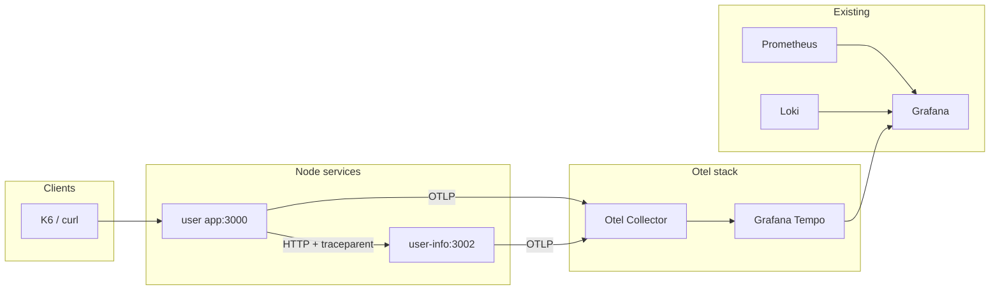

# OpenTelemetry distributed tracing

This document describes the OpenTelemetry (Otel) tracing setup for the node-playground: end-to-end traces across the **user** (app) and **user-info** services, viewable in Grafana.

## What was done

- **Docker:** Added OpenTelemetry Collector and Grafana Tempo. The collector receives OTLP (HTTP/gRPC) from the Node services and forwards traces to Tempo. Tempo stores traces and exposes an HTTP API for Grafana.
- **Observability package:** Added `initTracing()` in `@node-playground/observability` using the Otel Node SDK: OTLP HTTP exporter, Express instrumentation (incoming HTTP), and Fetch instrumentation (outgoing HTTP and W3C trace context propagation).
- **Services:** Both **user** and **user-info** call `initTracing()` at startup via an `instrumentation` module imported first so the SDK is registered before Express loads.
- **Grafana:** Tempo is provisioned as a datasource so you can search and view traces in Explore.

## Architecture



- **user** and **user-info** send OTLP spans to the collector (`OTEL_EXPORTER_OTLP_ENDPOINT`).
- The collector forwards traces to Tempo (OTLP gRPC).
- Outbound `fetch()` from user to user-info is instrumented and injects W3C Trace Context headers, so one logical request produces a single trace with spans from both services.

## How to run

1. Start the stack (including Tempo and the collector):

   ```bash
   docker compose up -d app user-info otel-collector tempo grafana
   ```

2. Ensure app and user-info have:
   - `OTEL_EXPORTER_OTLP_ENDPOINT=http://otel-collector:4318`
   - `OTEL_SERVICE_NAME=user` or `OTEL_SERVICE_NAME=user-info`  
   These are set in `docker-compose.yml`.

3. Generate traffic that crosses services (e.g. `GET /users/:id` that calls user-info for profile, or use the load script).

## How to view traces

1. Open Grafana (default http://localhost:3001, admin/admin).
2. Go to **Explore** and select the **Tempo** datasource.
3. Run a search (e.g. time range + optional filters). Open a trace to see spans; with Phase 2 (Fetch instrumentation) you should see one trace containing both **user** and **user-info** spans for a single request.

## Config reference

| Environment variable | Description |
|----------------------|-------------|
| `OTEL_EXPORTER_OTLP_ENDPOINT` | Base URL for OTLP export (e.g. `http://otel-collector:4318`). Default: `http://localhost:4318`. |
| `OTEL_SERVICE_NAME` | Service name attached to all spans (e.g. `user`, `user-info`). |

**Config files:**

- **Otel Collector:** `otel-collector/otel-collector-config.yml` — OTLP receiver (4317 gRPC, 4318 HTTP), OTLP exporter to Tempo.
- **Tempo:** `tempo/tempo-config.yml` — server port 3200, OTLP receivers (4317/4318), local storage.
- **Grafana Tempo datasource:** `grafana/provisioning/datasources/tempo.yml` — URL `http://tempo:3200`.

## Optional: trace ID in logs

To correlate logs (Loki) with traces (Tempo), you can add the current trace ID to your pino logger (e.g. via a mixin that reads `trace.getSpan(context.active())?.spanContext().traceId` and adds it to the log object). Not implemented in this setup; add if you need log-to-trace linking.
